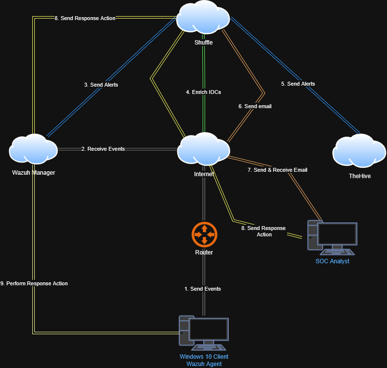

# SOC-Automation-Home-Lab-Project

## Overview
This project demonstrates a fully automated Security Operations Center (SOC) workflow designed to detect, enrich, and respond to security incidents. The environment simulates real-world security monitoring by integrating endpoint detection, threat intelligence enrichment, case management, and automated response.

The goal of this lab was to gain hands-on experience with SIEM, SOAR, and incident response tools while understanding the end-to-end SOC workflow.

## Version
02/18/2025

## Authors
Authored by [Sheila Montecino](https://github.com/0-monty-0)

## Architecture
The following diagram shows the workflow of the SOC automation pipeline:

### Workflow Summary
1. A Windows endpoint generates security events.
2. Events are sent to the Wazuh Manager for detection and alerting.
3. Alerts are forwarded to Shuffle for automation.
4. Shuffle enriches Indicators of Compromise (IOCs) using threat intelligence.
5. Automated email notifications are sent to the SOC analyst.
6. Incidents are created and tracked in TheHive.
7. Response actions are triggered based on the alert.
  
### Tools & Technologies 
- Virtualization: Oracle VirtualBox
- Endpoint Simulation: Windows 11 pro
- Cloud Infastructure: Vultr 
- SIEM: Wazuh 
- Database: Apache Cassandra 
- Log Storage and Search: Elasticsearch  
- Incident Response Platform: TheHive 
- SOAR: Shuffle
- Threat Intelligence: VirusTotal 

## Objectives

- Simulate a real-world SOC environment.
- Detect malicious activity and generate alerts.
- Automate threat intelligence enrichment.
- Reduce manual incident triage.
- Gain hands-on experience with security monitoring and response.
- Understand the incident lifecycle from detection to remediation.

## Lab Setup

The lab environment was built using virtual machines and cloud infrastructure.

### Key Setup Steps
1. Created a virtualized environment and deployed a Windows 11 endpoint.
2. Installed and configured the Wazuh agent on the Windows system.
3. Configured the Wazuh Manager to collect and analyze logs.
4. Installed Elasticsearch for centralized log storage and search.
5. Deployed TheHive and configured Apache Cassandra as the backend database.
6. Set up Shuffle and created automation workflows.
7. Integrated VirusTotal API for automated threat intelligence enrichment.
8. Configured email alerting for incident notifications.

## Attack Simulation

Credential dumping activity was simulated using Mimikatz to generate malicious behavior on the Windows endpoint.

This attack triggered:
- Detection and alert generation in Wazuh.
- Automated alert forwarding to Shuffle.
- IOC extraction and hash enrichment.
- Automated threat intelligence lookup in VirusTotal.
- Email notification to the SOC analyst.
- Case creation in TheHive for incident tracking.

## Automation Workflow

Shuffle was configured to automate incident response processes, including:

- Receiving alerts from Wazuh via webhook.
- Extracting malicious hash values from alerts.
- Performing SHA256 hash analysis.
- Enriching indicators using VirusTotal.
- Sending automated email notifications.
- Creating and updating cases in TheHive.

This automation reduces manual workload and improves incident response speed.

## Screenshots

### Wazuh Alert

### Shuffle Workflow

### TheHive Case

## Challenges and Troubleshooting

During this project, several technical challenges were encountered and resolved:

- Troubleshooting connectivity issues between Elasticsearch and TheHive.
- Resolving backend service failures during setup.
- Debugging webhook communication between Wazuh and Shuffle.
- Fixing configuration and networking issues between virtual machines.
- Ensuring proper alert forwarding and automation triggers.

These challenges strengthened troubleshooting, system administration, and integration skills.

## Future Improvements

Planned enhancements for this lab include:

- Simulating additional attacks such as brute-force, lateral movement, and persistence.
- Integrating additional threat intelligence sources.
- Implementing automated endpoint isolation.
- Expanding monitoring to cloud-based environments.
- Creating custom detection rules and dashboards.
- Adding Slack or messaging alert integrations.
- Building threat hunting workflows.

## Lessons Learned

This project strengthened my understanding of:

This project provided practical experience in building and operating a SOC environment. It improved my understanding of security monitoring, automation, and the incident response lifecycle. Additionally, it strengthened my troubleshooting skills and ability to integrate multiple security tools into a unified workflow.

